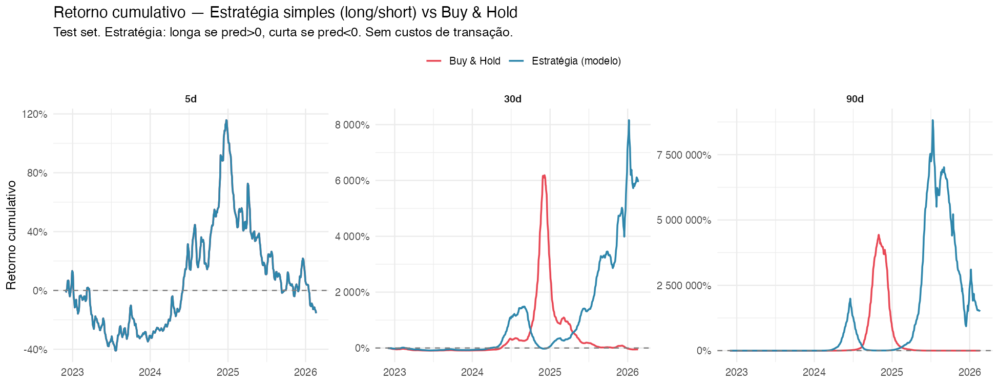
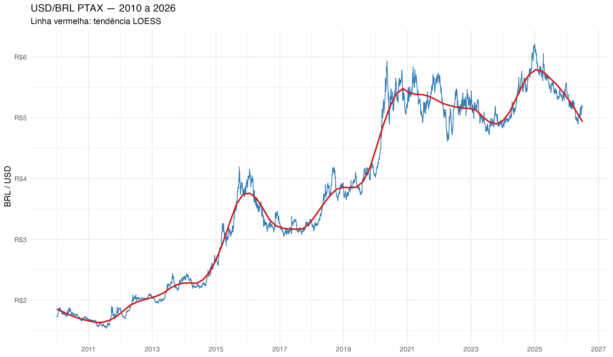
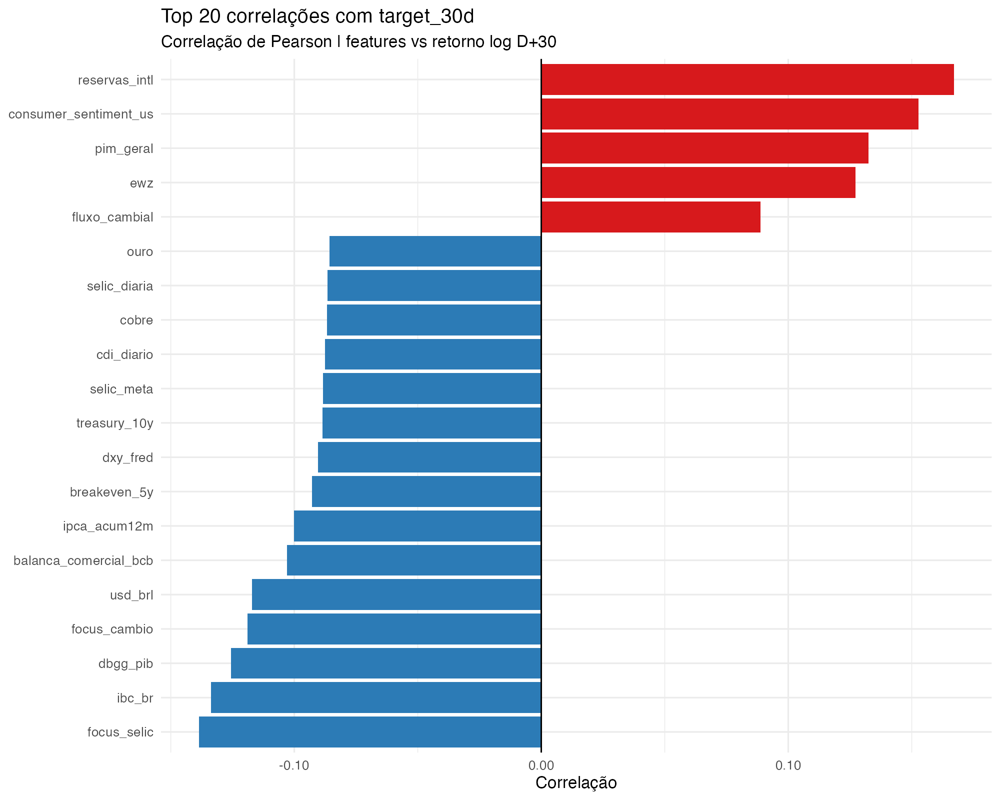
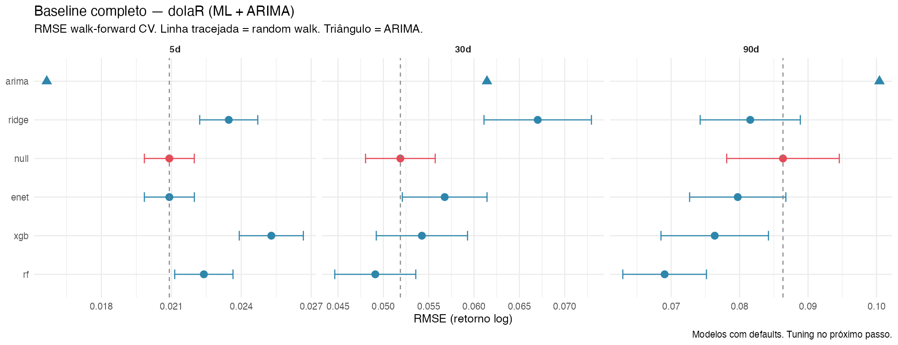
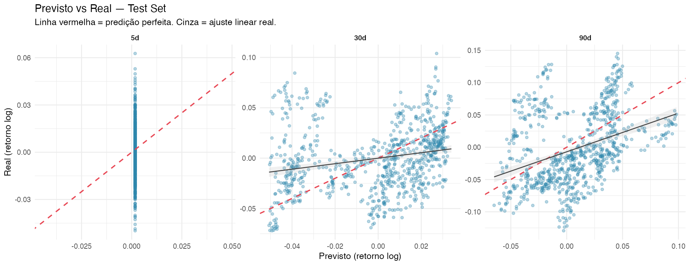
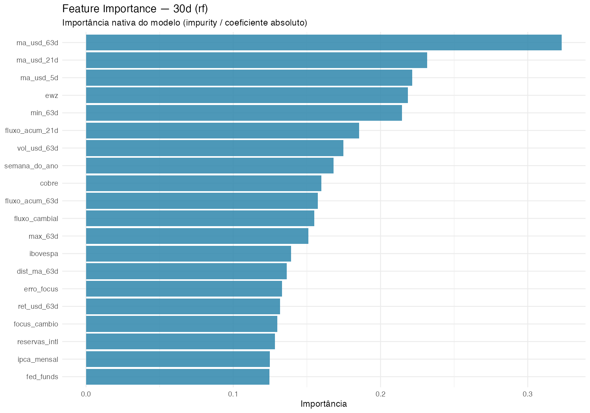

# dolaR — Prevendo USD/BRL com R e agentes generativos

Projeto de data science em R para prever o câmbio USD/BRL nos horizontes de **5, 30 e 90 dias**, usando técnicas de séries temporais, machine learning tabular e validação walk-forward rigorosa.

> **Projeto educacional.** Não usar para decisões financeiras reais. Os retornos de estratégia reportados são teóricos e não incluem custos de transação.

---

## Resultados

Pipeline de modelagem completo. Champions avaliados em test set holdout (810 obs, nov/2022–fev/2026):

| Horizonte | Champion | Test RMSE | CV RMSE | Dir. Accuracy | Strategy Return | Buy & Hold |
|-----------|----------|-----------|---------|--------------|-----------------|-----------|
| **D+5**  | Elastic Net | 0.0159 | 0.0209 | 49.3% | -15.6% | -15.6% |
| **D+30** | Random Forest | 0.0363 | 0.0497 | **61.0%** | **+5.940%** | -51.4% |
| **D+90** | XGBoost | 0.0554 | 0.0688 | 58.4% | +1.505.861% | -95.2% |

> ARIMA D+5 benchmark (CV): RMSE=0.0157 — ElasticNet no test set (0.0159) praticamente empata.



**Leitura:** D+30 (Random Forest) é o único horizonte com valor econômico robusto — 61% de acurácia direcional e retorno cumulativo de +5.940% vs -51% do buy-and-hold no mesmo período. D+5 é praticamente coin flip (49,3%), consistente com a Hipótese de Mercado Eficiente no curto prazo.

---

## O Problema

Prever câmbio é uma das tarefas mais difíceis em data science financeiro. Meese & Rogoff (1983) demonstraram que modelos econômicos estruturais não batem o random walk em horizontes curtos — e esse resultado continua válido décadas depois.

A hipótese central deste projeto: **o que explica o dólar em 5 dias não é o mesmo que explica em 90 dias**.

| Horizonte | Perfil | Drivers esperados |
|-----------|--------|-------------------|
| **D+5**  | Curto prazo | Momentum, volatilidade, fluxo cambial, ruído de mercado |
| **D+30** | Médio prazo | Carry trade, risco-país, commodities, expectativas Focus |
| **D+90** | Macro prazo | Fundamentos macroeconômicos, política monetária, fiscal |

**Variáveis-alvo:** retornos logarítmicos, não preços brutos — garantem estacionariedade e evitam que o modelo aprenda apenas a tendência de depreciação secular do real.

```
target_H = log( USD/BRL[t+H] / USD/BRL[t] )    para H ∈ {5, 30, 90} dias úteis
```



O câmbio saiu de ~R$1,75 em 2011 para mais de R$6,00 em momentos de estresse — série claramente não-estacionária, com regime-breaks em 2015 (crise fiscal), 2020 (COVID-19) e 2022-2024 (pressão fiscal).

---

## Pipeline

Projeto executado em 13 scripts sequenciais, cada um com responsabilidade única:

```
Fase 1–3 (Ada)  — Setup, Coleta e Dataset
  01-setup.R               Verificação de ambiente e dependências
  02-collect-market.R      BCB PTAX + Yahoo Finance (11 tickers)
  03-collect-macro-br.R    BCB SGS + Focus + IBGE IPCA
  04-collect-macro-us.R    FRED (10 séries macro EUA)
  05-collect-b3.R          Placeholder (DOL=F indisponível; BVSP via Yahoo)
  06-build-dataset.R       Join 9 fontes → daily_dataset.rds + model_dataset.rds
  07-collect-fiscal-activity.R   BCB SGS fiscal + IBGE PIM/PNAD
  08-collect-global-indicators.R FRED commodities + breakevens + HY spread

Fase 4–5 (Grace) — EDA e Feature Engineering
  09-eda.R                 EDA exploratório completo (11 plots + 9 tabelas)
  10-feature-engineering.R 52 features em 5 grupos → features_dataset.rds

Fase 6–8 (Alan) — Modelagem
  11-modeling.R            Baseline: 5 modelos × 3 horizontes × 39 folds CV
  11b-arima-baseline.R     ARIMA walk-forward manual
  12-tuning.R              Hyperparameter tuning (LHS, 30 configs por modelo)
  13-evaluation.R          Avaliação final no test set (one touch)
```

**Status do pipeline:**
- [x] Fase 1 — Setup e estrutura
- [x] Fase 2 — Coleta (BCB, Yahoo, FRED, IBGE) — 9 fontes
- [x] Fase 3 — Dataset unificado (4.052 obs, 60 vars, 2010–2026)
- [x] Fase 4 — EDA
- [x] Fase 5 — Feature Engineering (52 features, 5 grupos)
- [x] Fase 6 — Baseline modeling (5 modelos × 3 horizontes)
- [x] Fase 7 — Hyperparameter tuning (LHS 30 configs)
- [x] Fase 8 — Avaliação final no test set
- [ ] Fase 9 — Relatório e dashboard (em andamento — Marie)
- [ ] Fase 10 — Deploy via Vetiver API

---

## Dataset

**4.052 observações diárias** (2010-01-04 a 2026-02-19), integradas de 9 fontes:

| Fonte | Pacote R | Tipo | Frequência | N vars |
|-------|----------|------|-----------|--------|
| BCB PTAX | rbcb | Câmbio oficial | Diária | 1 |
| BCB SGS (diário) | rbcb | Juros, reservas, crédito | Diária | 5 |
| BCB SGS (mensal) | rbcb | Macro BR, fiscal, atividade | Mensal | 11 |
| BCB Focus | rbcb | Expectativas de mercado | Semanal | 4 |
| Yahoo Finance | tidyquant | Mercado global (DXY, VIX, Ibov, S&P…) | Diária | 11 |
| FRED (principal) | fredr | Macro EUA, juros, inflação | Mensal | 6 |
| FRED (adicional) | fredr | Commodities, breakeven, HY spread | Diária/Mensal | 8 |
| IBGE SIDRA IPCA | sidrar | Inflação Brasil | Mensal | 6 |
| IBGE SIDRA PIM/PNAD | sidrar | Produção industrial, desemprego | Mensal/Trim | 2 |

**60 variáveis brutas** + **52 features engenheiradas** = **111 variáveis** no dataset de modelagem.

---

## Feature Engineering

52 features em 5 grupos, todas calculadas com dados históricos (sem leakage):

| Grupo | N | Exemplos |
|-------|---|---------|
| **G1 — Retornos e Momentum** | 14 | ret_usd_1d/5d/21d/63d, ma_usd_*, dist_ma_*, drawdown_63d |
| **G2 — Volatilidade Realizada** | 6 | vol_usd_5d/21d/63d, vol_ratio, vol_vix_21d |
| **G3 — Spreads Macrofinanceiros** | 10 | spread_selic_fed, spread_10y_2y_us, fluxo_acum_21d/63d, ret_ewz_* |
| **G4 — Retornos Externos** | 16 | ret_dxy_*, ret_vix_*, ret_oil_*, ret_ibov_*, ret_sp500_*, erro_focus |
| **G5 — Calendário** | 8 | dia_semana, mes, fim_de_mes, mes_copom, mes_fomc |



---

## Modelos e Performance (CV Walk-Forward)

5 modelos testados, validados com `sliding_window` (lookback=756 obs ≈ 3 anos, step=63 ≈ 1 trimestre, 39 folds):

| Modelo | D+5 RMSE | D+30 RMSE | D+90 RMSE |
|--------|----------|-----------|-----------|
| ARIMA | **0.0157** ✅ | 0.0614 ❌ | 0.100 ❌ |
| Random Walk (null) | 0.0209 | 0.0519 | 0.0863 |
| Elastic Net | 0.0209 ✅ | 0.0568 ❌ | 0.0797 ✅ |
| **Random Forest** | 0.0224 ✅ | **0.0491** ✅ | **0.0690** ✅ |
| XGBoost | 0.0253 ❌ | 0.0543 ✅ | 0.0764 ✅ |
| Ridge | 0.0235 ❌ | 0.0670 ❌ | 0.0816 ✅ |

✅ = supera o random walk · ❌ = não supera



**Champions após hyperparameter tuning (LHS, 30 configurações):**
- **D+5:** Elastic Net (penalty + mixture otimizados)
- **D+30:** Random Forest (mtry + min_n otimizados)
- **D+90:** XGBoost (tree_depth + min_n + learn_rate + mtry otimizados)

---

## Avaliação Final no Test Set



Test RMSE ficou **abaixo** do CV RMSE em todos os horizontes — o período de teste (2022–2026) foi menos volátil que o de treino (2010–2022, que inclui COVID/2020).

### Feature Importance — D+30 (Random Forest)



As features de volatilidade realizada e retornos de commodities/DXY dominam o sinal para D+30 — consistente com a hipótese de que fatores de mercado de médio prazo dirigem o câmbio.

---

## Estratégia de Validação

**Walk-forward com janela deslizante** — nunca validação aleatória em séries temporais:

```
Fold 1:  [Jan/2010 ─────── Dez/2012] | [Jan–Mar/2013]
Fold 2:  [Abr/2010 ──────── Mar/2013] | [Abr–Jun/2013]
...
Fold 39: [........... últimos 3 anos] | [último trimestre]

Lookback: 756 dias úteis (~3 anos)
Step:      63 dias (~1 trimestre)
Assess:    63 dias (~1 trimestre)
Total:     39 folds
```

**Split 80/20 temporal:**
- Train+Val: 3.242 obs (2010-01-04 a ~out/2022)
- Test: 810 obs (~nov/2022 a fev/2026) — tocado apenas uma vez, no script `13-evaluation.R`

---

## Setup

### Pré-requisitos

- R >= 4.3
- RStudio ou VS Code com extensão R
- Git

### Clonar e abrir o projeto

```bash
git clone https://github.com/GiulSposito/dolaR.git
cd dolaR
# Abrir dolaR.Rproj no RStudio
```

### Inicializar renv

```r
install.packages("renv")
renv::restore()  # instala todos os pacotes do renv.lock
```

### Configurar chaves de API

```bash
cp .Renviron.local.template .Renviron.local
# Editar .Renviron.local com sua chave FRED
```

Chave necessária:
- **FRED API Key** — gratuita em [fred.stlouisfed.org](https://fred.stlouisfed.org/docs/api/api_key.html)

### Executar o pipeline

```r
# Executar em sequência no RStudio:
source(here::here("scripts/01-setup.R"))
source(here::here("scripts/02-collect-market.R"))
# ... (ver scripts/ para ordem completa)
source(here::here("scripts/13-evaluation.R"))
```

---

## Estrutura do projeto

```
dolaR/
├── scripts/
│   ├── 01-setup.R                    # Verificação de ambiente
│   ├── 02-collect-market.R           # BCB PTAX + Yahoo Finance
│   ├── 03-collect-macro-br.R         # BCB SGS + Focus + IBGE IPCA
│   ├── 04-collect-macro-us.R         # FRED macro EUA
│   ├── 05-collect-b3.R               # Placeholder B3
│   ├── 06-build-dataset.R            # Join 9 fontes → datasets
│   ├── 07-collect-fiscal-activity.R  # BCB SGS fiscal + IBGE PIM/PNAD
│   ├── 08-collect-global-indicators.R# FRED commodities + breakevens
│   ├── 09-eda.R                      # Análise exploratória (Grace)
│   ├── 10-feature-engineering.R      # 52 features em 5 grupos (Grace)
│   ├── 11-modeling.R                 # Baseline: 5 modelos × 3 horizontes (Alan)
│   ├── 11b-arima-baseline.R          # ARIMA walk-forward (Alan)
│   ├── 12-tuning.R                   # Hyperparameter tuning LHS (Alan)
│   └── 13-evaluation.R              # Avaliação final test set (Alan)
├── data/
│   ├── raw/                          # APIs — gitignored
│   ├── processed/                    # Datasets — gitignored
│   └── reference/                    # br_feriados.csv
├── models/                           # Artefatos — gitignored
├── outputs/
│   ├── figures/                      # Gráficos (versionados)
│   └── tables/                       # Métricas e CSVs (versionados)
├── reports/
│   ├── technical-report.qmd          # Relatório técnico (Quarto)
│   └── technical-report.html         # Relatório renderizado
├── docs/
│   └── briefing.md                   # Briefing do problema
└── _bmad/                            # Framework Helix DS
    └── _memory/                      # Memória dos agentes
```

---

## Agentes Helix DS

Projeto desenvolvido com o framework **Helix DS** e agentes especializados:

| Agente | Responsabilidade | Fases |
|--------|-----------------|-------|
| **Ada** | Setup, coleta e construção do dataset | 1–3 |
| **Grace** | EDA e engenharia de atributos | 4–5 |
| **Alan** | Modelagem, tuning e avaliação | 6–8 |
| **Marie** | Comunicação e deploy | 9–10 |

---

## Relatório Técnico

O relatório técnico completo (30+ páginas, tom educacional) está disponível em:

- `reports/technical-report.qmd` — source Quarto
- `reports/technical-report.html` — renderizado (abrir localmente)

O relatório cobre: teoria econômica por tipo de dado, EDA detalhado, feature engineering, teoria dos modelos, walk-forward CV, hyperparameter tuning, e análise crítica dos resultados.

---

*Gerado com Claude Code + Helix DS | 2026-07-03*
